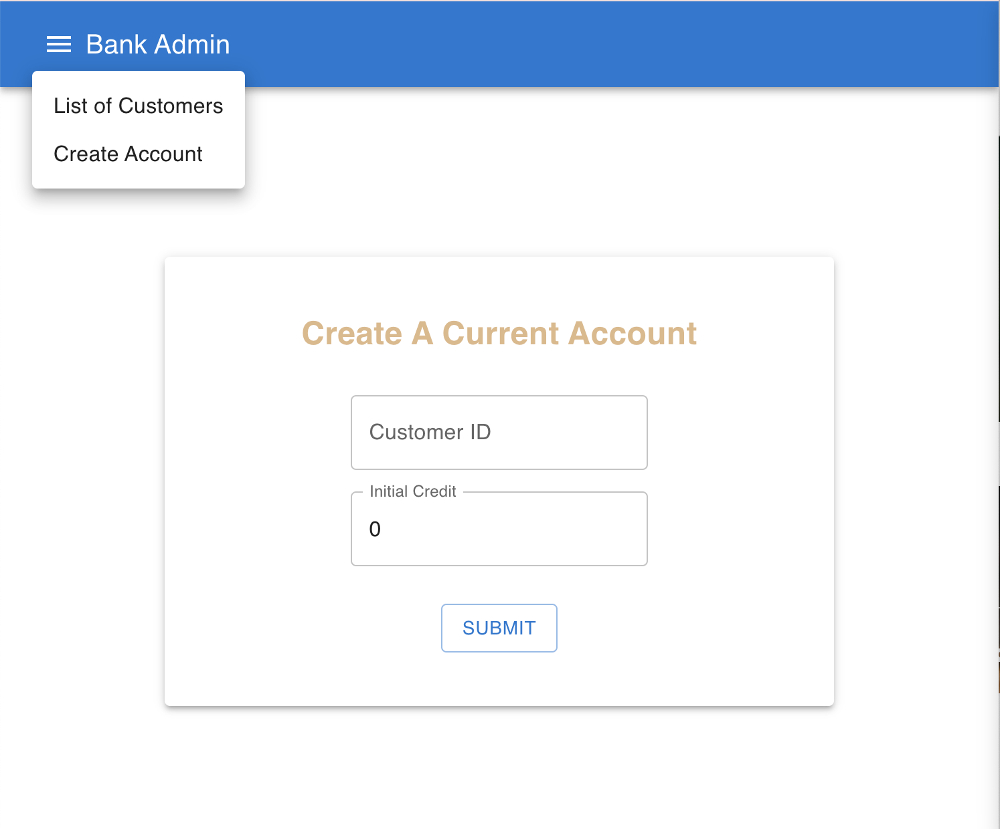
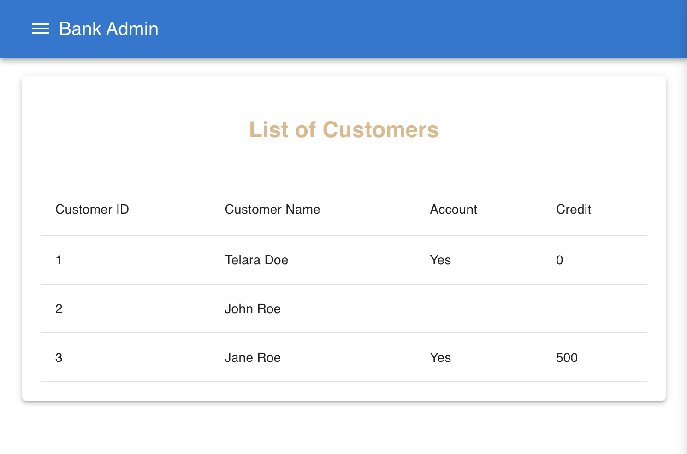

## How to get the bank app started 

### Prerequisites
- **Node.js**: Version 18.x.x or above (for the front-end)
- **Java**: Version 17 (for the back-end)
- **Docker Desktop**: For running the PostgreSQL database

### Project Structure
- `demo`: Contains the back-end code (Spring Boot)
- `demo-front-end`: Contains the front-end code (React)

### Database
- **Database:** First, run the docke-compose.yml to start the persistent database in PostgreSQL. For CI/CD considerations, and for your ease of use, docker has been implemented. Ensure you have Docker Desktop downloaded on your machine. The command in terminal:

 ```bash
  docker-compose up -d
  ```

### Back-End
- **Back-end:** Then fire up the main in the back-end folder called demo. I use IntelliJ, but use whichever IDEA of your choice, and navigate to:
`./demo/src/main/java/com/example/demo/DemoApplication.java` to run main.

### Front-End

- **Front-end:** Finally, `npm start` inside the `./demo-front-end` directory. The command in terminal:

``` bash
npm start
```

### App in Action

This should open up the following screen:



You can navigate to the List of Customers page to get an overview of all the customers via the menu bar:




## Future work
This is a demo of a full-stack application made under time constraints. If time constraints were not an issue, I would continue by doing the following *TODOs*:

- [ ] Add DTO in back-end (b-e)

- [ ] Separate CustomerService and CustomerServiceImpl in b-e

- [ ] Unique error codes in back-end to display informative errors in the front-end

- [ ] Show error bar to explain why some form inputs are invalid, for both front-end and back-end errors

- [ ] Deal with React vulnerabilities 

- [ ] Check project with a eslinter

And many more improvements.